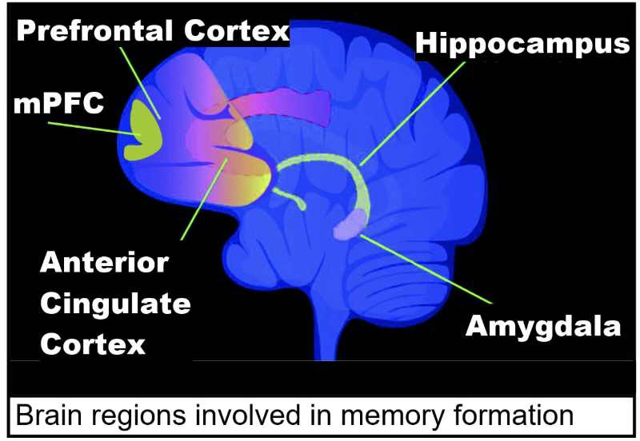
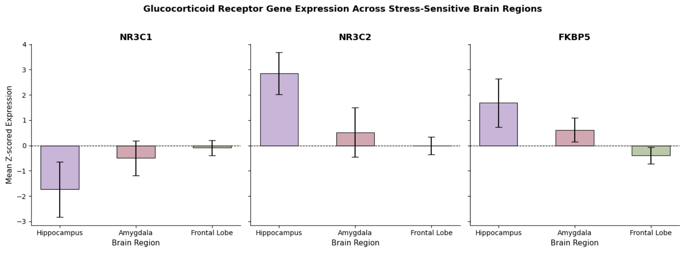
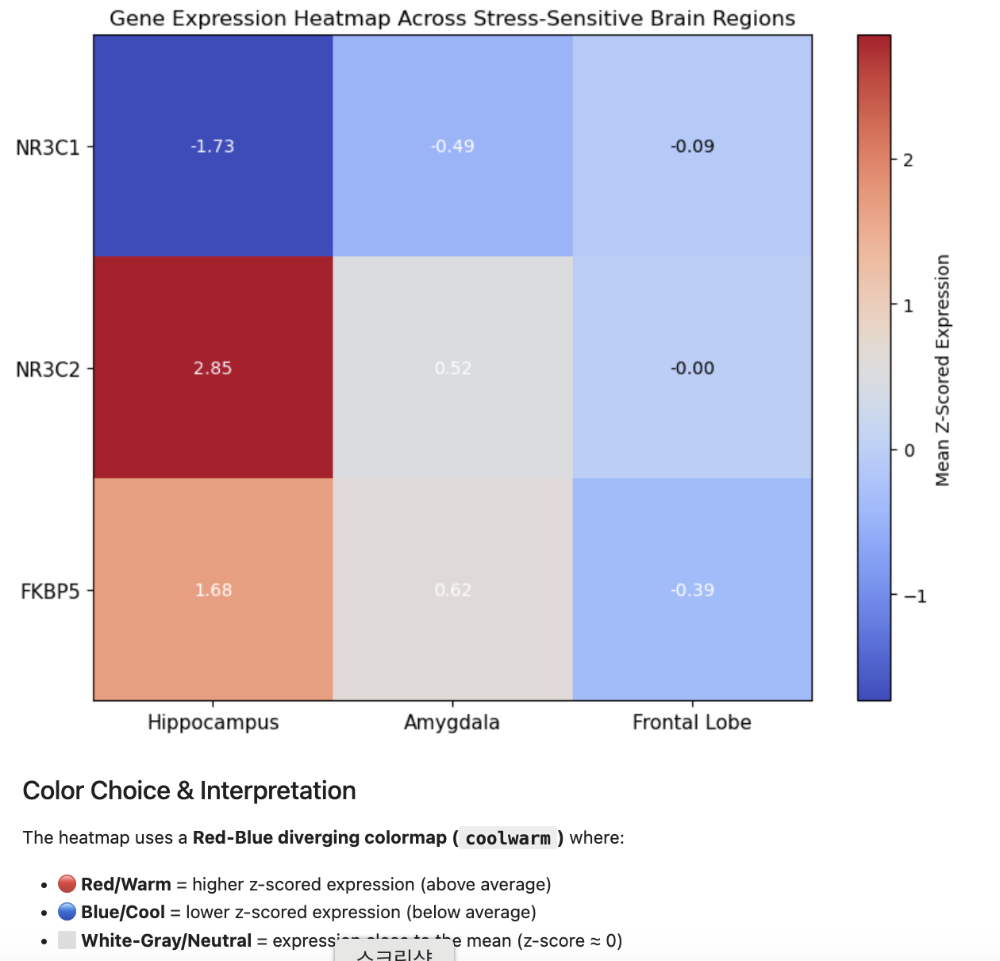
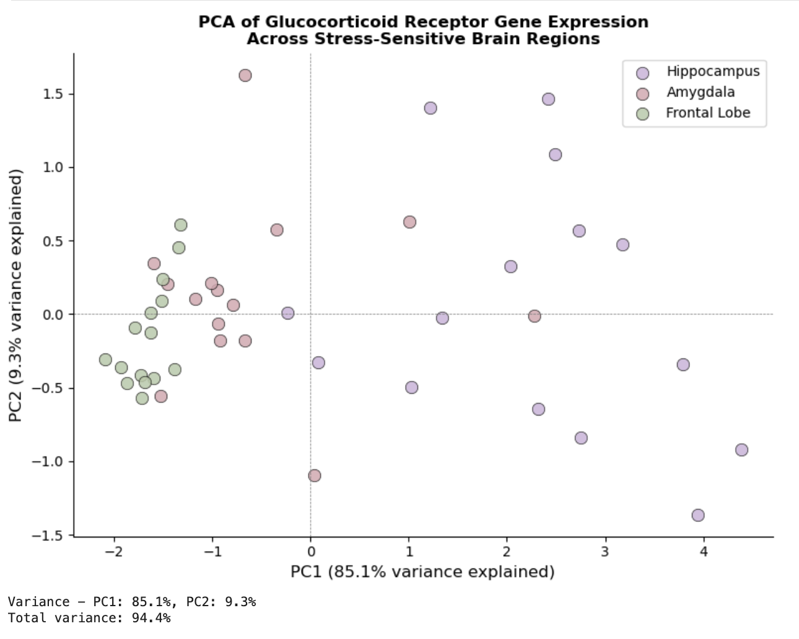
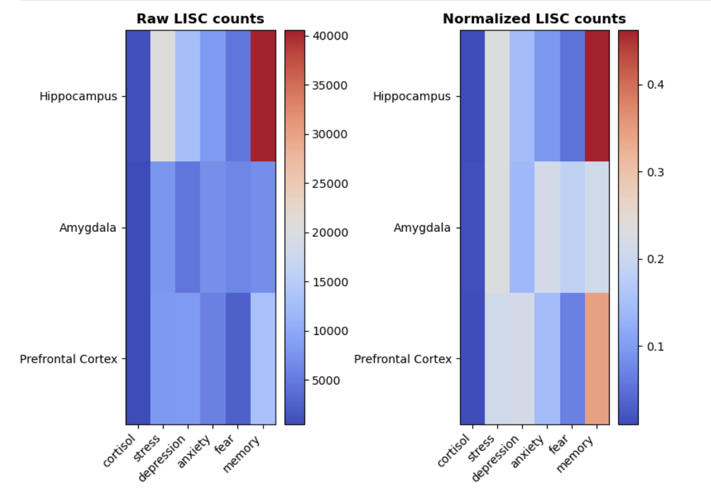
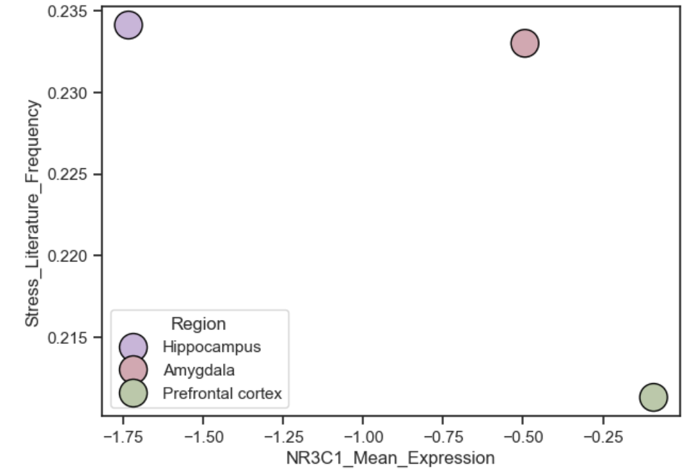

# UC San Diego: Neural Data Science
## Mapping the Stress Brain: Glucocorticoid Receptor Gene Expression and Behavioral Associations Across Stress-Sensitive Regions.

---

## 👥 Team Members & Permissions
* **Khang Quach** (PID: A_______) 
* **Veeratat K.** (PID: A12468077) 
* **Brandon Melendez-Rodriguez** (PID: A_______) 
* **Hyojeong Lee** (PID: A18491673) 

---

## 📝 Overview
In this project, we investigated the molecular and behavioral landscapes of the human stress response across three core brain regions: the **hippocampus**, **amygdala**, and **prefrontal cortex (PFC)**. 

Using gene expression microarray data from the *Allen Human Brain Atlas*, we analyzed the expression profiles of key stress-regulation genes ($NR3C1$, $NR3C2$, and $FKBP5$). We then integrated these molecular signatures with literature text-mining data from **LISC** to evaluate co-occurrence frequencies with stress-related behavioral terms in PubMed. Our multi-modal computational pipeline successfully links regional receptor densities to their functional and cognitive associations in published neuroscience literature.

  

---

## 🔬 Research Question
> Do the three core stress-sensitive brain regions (the amygdala, hippocampus, and prefrontal cortex) show distinct glucocorticoid receptor gene expression patterns, specifically in the $NR3C1$, $NR3C2$, and $FKBP5$ regions in the human brain, and do these molecular patterns align with the behavioral and cognitive terms most associated with each region in the published neuroscientific literature?

---

## 💡 Hypothesis
We hypothesize that the **hippocampus** will show the highest expression of $NR3C1$ and $NR3C2$ among the three regions, and that all three regions will show strong co-occurrence with stress and anxiety terms in the literature, with the **amygdala** most associated with fear and the **PFC** most associated with emotion regulation.

---

## 📊 Datasets

### 1. Allen Human Brain Atlas (Microarray Survey)
* **Description:** Provides comprehensive z-scored gene expression values across thousands of anatomically precise tissue samples in the adult human brain, allowing us to profile the baseline density of glucocorticoid and mineralocorticoid receptors.
* **Observations:** Capped at 15 samples per brain region (Hippocampal formation, Amygdala, Frontal lobe) across adult donor brains to comply with DataHub memory limits.
* **Source:** [Allen Microarray Atlas](https://human.brain-map.org/)

### 2. LISC (Literature-based Information for Scientists in Computational Neuroscience)
* **Description:** Automatically mines online PubMed literature in real-time to generate a co-occurrence frequency matrix, quantifying how strongly specific brain structures are associated with cognitive and behavioral concepts.
* **Observations:** Co-occurrence counts from PubMed queries combining 3 brain region terms with 6 behavioral keywords (`cortisol`, `stress`, `depression`, `anxiety`, `fear`, `memory`).
* **Source:** [LISC Tools](https://lisc-tools.github.io/lisc/)

### Dataset Combination Strategy
We extracted the mean gene expression z-scores for each target region from the Allen Atlas and correlated them directly with the normalized behavioral co-occurrence frequencies obtained from LISC using heatmaps, bar charts, and statistical tests (ANOVA).

---

## 🛠️ Data Cleaning & Wrangling
* **Structure Name Alignment:** During mapping, we discovered that the Allen Brain Atlas labels the hippocampus as **"hippocampal formation"** (encompassing CA1-CA4, dentate gyrus, and subiculum). Filters were adjusted to correctly capture these tissue layers.
* **Memory Optimization:** Due to UCSD DataHub environment limitations, the massive Allen microarray datasets were optimized and capped at 15 samples per target region to prevent memory crashes.
* **LISC Upgrade:** Fixed a dependency issue on DataHub where the pre-installed version of `lisc` was outdated by forcefully upgrading `beautifulsoup4` and `lisc` via `pip`.

---

## 📈 Data Analysis & Results

### 1. Glucocorticoid Receptor Gene Expression (Bar Charts)
We calculated and plotted the mean z-scored expression of $NR3C1$, $NR3C2$, and $FKBP5$ across our three target regions. Standard deviation error bars indicate the structural variance across the sample groups.

### 2. Gene Expression Cross-Comparison (Heatmap)
To easily compare the genomic density across regions, we mapped out a consolidated heatmap matrix.
* 🔴 **Red/Warm** = higher z-scored expression (above average)
* 🔵 **Blue/Cool** = lower z-scored expression (below average)
* ⬜ **White-Gray/Neutral** = expression close to the mean (z-score ≈ 0)

### 3. Principal Component Analysis (PCA)
A PCA on the microarray expressions displays clear, localized clustering corresponding directly to each individual brain region, capturing a cumulative variance explanation across PC1 and PC2.

### 4. PubMed Co-occurrence Matrix (LISC Heatmaps)
Using LISC text-mining, we mapped both raw literature hit counts and row-normalized scores for region-to-keyword relationships. The normalized matrix shows that while the hippocampus is overwhelmingly associated with general `memory`, the prefrontal cortex exhibits a balanced distribution toward cognitive functions and emotional dysregulation terms like `depression`.

### 5. Gene-Literature Cross-Correlation
Plotting the mean expression of $NR3C1$ directly against the normalized literature frequency of the keyword `stress` reveals regional alignment behavior, mapping out distinct spatial boundaries for the Prefrontal Cortex, Amygdala, and Hippocampus.

---

## 📚 References
1. Hawrylycz, M. J., et al. (2012). *An anatomically comprehensive atlas of the adult human brain transcriptome*. Nature, 489, 391-399. [https://doi.org/10.1038/nature11405](https://doi.org/10.1038/nature11405)
2. Pagliaccio, D., et al. (2014). *Stress-system genes and life stress predict cortisol levels and amygdala and hippocampal volumes in children*. Neuropsychopharmacology, 39(5), 1245-1253. [https://doi.org/10.1038/npp.2013.336](https://doi.org/10.1038/npp.2013.336)
3. van der Meer, D., et al. (2020). *Brain scanning the city: Identifying stress-related brain regions using the Allen Human Brain Atlas*. Translational Psychiatry, 10, 176. [https://doi.org/10.1038/s41398-020-0854-y](https://doi.org/10.1038/s41398-020-0854-y)
